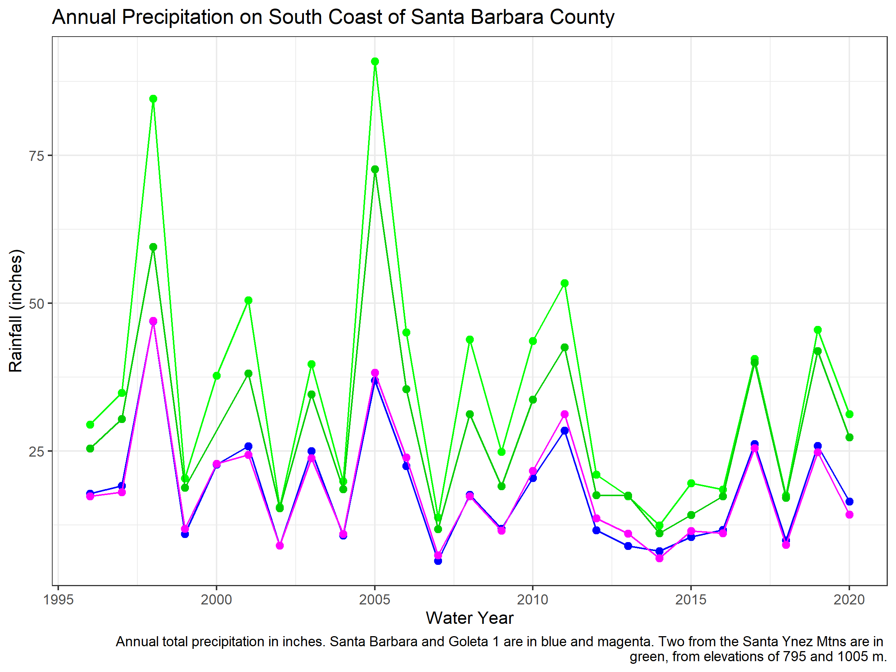
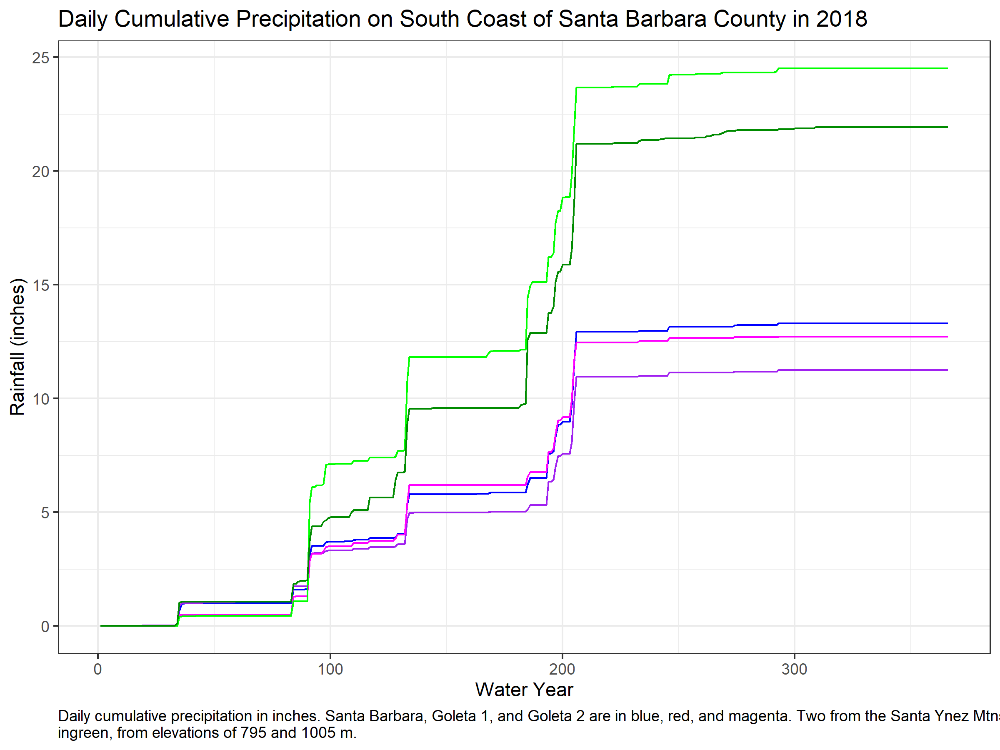
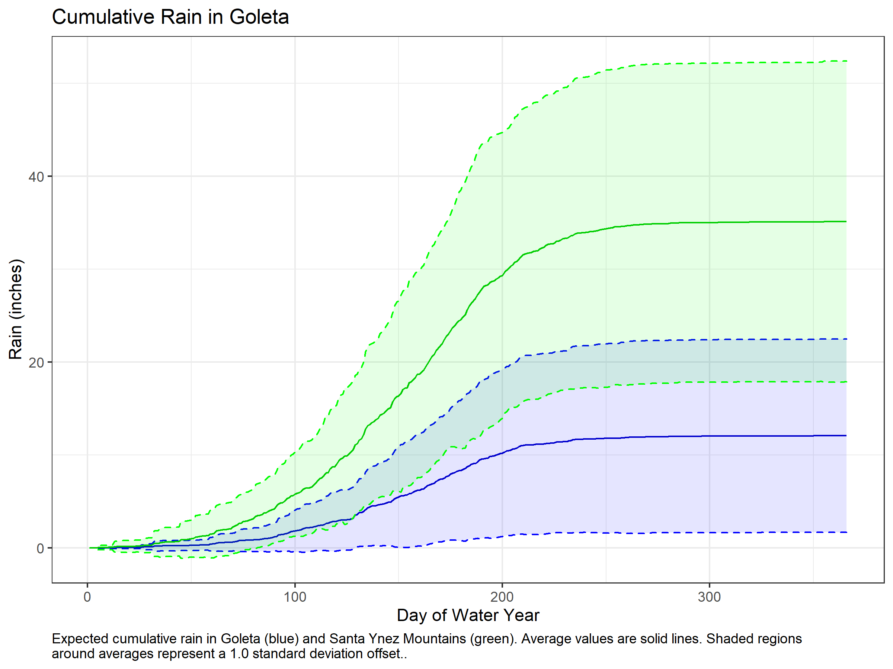

# Rainfall Resampling

Library to perform some basic analysis using rain gauge data.

# Rain Statistics

The file *rainyear_aggregation.r* generates some basic visualizations from rain gauge data in Santa Barbara county. Examples below:

  

Above, annual rainfall values from 1995 to 2020 for areas on the South Coast of Santa Barbara County.  

  

Above, daily cumulative rainfall on the South Coast of Santa Barbara County in 2018. Note that the mountains receive much more precipitation than the lowlands.  

  

Similarly, daily cumulative rainfall average values for different regions on the South Coast of Santa Barbara County.  
